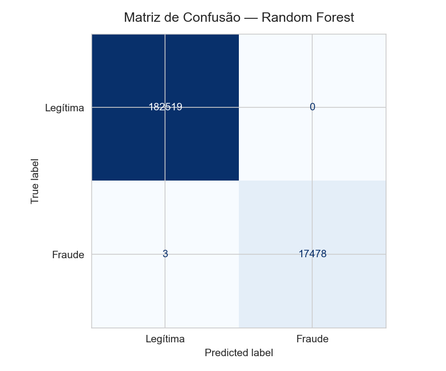
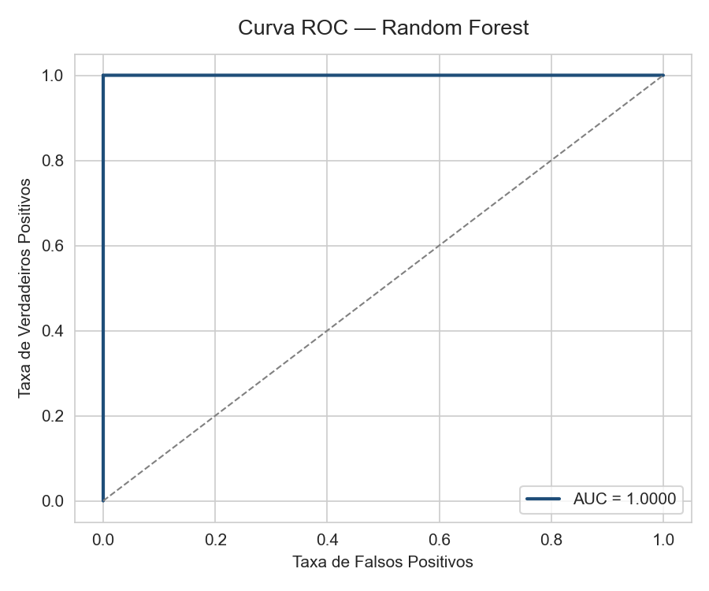

# Modelo de Detecção de Fraude em Transações de Cartão


Solução de Machine Learning para classificação de transações fraudulentas em cartão de crédito, estruturada sob a metodologia CRISP-DM. O projeto abrange desde a análise exploratória até a proposta de deploy em produção.

## Índice
 
- [Contexto do Problema](#contexto-do-problema)
- [Objetivo](#objetivo)
- [Dataset](#dataset)
- [Metodologia](#metodologia)
- [Destaques da Análise](#destaques-da-análise)
- [Resultados](#resultados)
- [Estrutura do Projeto](#estrutura-do-projeto)
- [Como Executar](#como-executar)
- [Plano de Deploy](#plano-de-deploy)
- [Próximos Passos](#próximos-passos)


## Contexto do Problema
Fraudes em transações de cartão representam um problema crítico para instituições financeiras. Identificar transações fraudulentas em tempo real — sem comprometer transações legítimas — exige modelos preditivos robustos, capazes de lidar com dados altamente desbalanceados e de operar com baixa latência.

## Objetivo
* Realizar uma Análise Exploratória de Dados 
* Criar features que traduzam regras de negócio e anomalias de segurança
* Treinar e comparar modelos de Machine Learning 
* Propor uma estratégia de produtização do modelo.

##  Dataset
- **Volume:** ~1 milhão de transações
- **Desbalanceamento:** 91,26% legítimas / 8,74% fraudulentas
- **Features originais:** `distance_from_home`, `distance_from_last_transaction`, `ratio_to_median_purchase_price`, `repeat_retailer`, `used_chip`, `used_pin_number`, `online_order`, `fraud`
- 📥 [Download do dataset](https://drive.google.com/file/d/1Ms99L-UZMABlCBKkE6HfhF9uEHc0wkAT/view)

##  Metodologia
 
O projeto foi estruturado seguindo as etapas do **CRISP-DM**:
 
```
1. Entendimento do Negócio   →  Definição de métricas-alvo e custo do erro
2. Entendimento dos Dados    →  EDA, distribuições, correlações
3. Preparação dos Dados      →  Limpeza, engenharia de features, balanceamento
4. Modelagem                 →  Regressão Logística vs. Random Forest
5. Avaliação                 →  Comparação por AUC, Recall e F1
6. Deploy                    →  Proposta de arquitetura com API + Docker
```
##  Destaques da Análise
 
### Engenharia de Feature: `risk_score`
 
A partir das 4 variáveis categóricas do dataset, foram mapeadas **16 combinações de tipo de transação** com suas respectivas taxas de fraude observadas:
 
| Tipo de Transação | Taxa de Fraude |
|---|---|
| Online (cliente novo, sem autenticação) | 16,62% |
| Token + Online | 10,37% – 11,62% |
| Contactless (cliente novo) | 10,22% |
| Inserção + senha | ~0% |
| Contactless + senha | 0% |
 
>  Transações online de clientes novos sem autenticação apresentam **2x mais risco** que clientes recorrentes na mesma modalidade.
 
Com base nessas taxas, foi criada a feature `risk_score` com 4 níveis:
 
| Nível | Classificação |
|---|---|
| 4 | Crítico |
| 3 | Alto |
| 2 | Médio |
| 1 | Baixo |
 
### Tratamento do Desbalanceamento
 
Optou-se por `class_weight='balanced'` em vez de SMOTE pelos seguintes motivos:
- Desbalanceamento moderado (~9%) não justifica geração de dados sintéticos
- Dataset com 1M de linhas tornaria o SMOTE proibitivo em custo computacional
- `class_weight` preserva a distribuição real dos dados
 
---
 
##  Resultados
 
| Modelo | AUC | Precision | Recall | F1-Score | Accuracy |
|---|---|---|---|---|---|
| Regressão Logística | 0.9439 | 0.5816 | 0.9534 | 0.7225 | 0.9360 |
| **Random Forest** | **0.9999** | **1.0000** | **0.9999** | **0.9999** | **0.9999** |

<p align="center">
  
  
</p>
 
✅ **Modelo escolhido: Random Forest**
 
O Random Forest superou amplamente a Regressão Logística em todas as métricas. O alto Recall (0.9999) confirma que o modelo praticamente elimina falsos negativos — o erro de maior custo para o negócio.
 
---
 
##  Estrutura do Projeto
 
```
fraud-detection-ml/
│
├── data/                     # Pasta reservada para o dataset (não versionado)
│   └── .gitkeep
│
├── notebooks/
│   └── deteccao_fraudes.ipynb   # Notebook principal com análise completa
│
├── requirements.txt          # Dependências do projeto
└── README.md
```
 
---
 
##  Como Executar
 
### Pré-requisitos
 
- Python 3.10+
- Jupyter Notebook ou Google Colab
 
### Passos
 
```bash
# 1. Clone o repositório
git clone https://github.com/gabrielctfrr/Modelo_de_Deteccao_Fraudes.git
cd Modelo_de_Deteccao_Fraudes
 
# 2. Instale as dependências
pip install -r requirements.txt
 
# 3. Faça o download do dataset e coloque na pasta data/
# Link: https://drive.google.com/file/d/1Ms99L-UZMABlCBKkE6HfhF9uEHc0wkAT/view
 
# 4. Execute o notebook
jupyter notebook notebooks/deteccao_fraudes.ipynb
```
 
> Alternativa: abra diretamente no [Google Colab](https://colab.research.google.com/) — as dependências já vêm instaladas por padrão.
 
---
 
##  Plano de Deploy
 
O modelo requer operação em **tempo real**, com baixa latência e alta disponibilidade. A arquitetura proposta considera:
 
- **API REST** que recebe dados da transação em JSON, aplica o pré-processamento e retorna a predição
- **Docker** para containerização e garantia de reprodutibilidade entre ambientes
- **Múltiplas instâncias** para escalabilidade horizontal em picos de requisições
- **Monitoramento contínuo** de métricas (especialmente Recall da classe fraude) para detectar data drift e degradação de performance
 
---
 
##  Próximos Passos
 
- [ ] Implementar a API REST com FastAPI
- [ ] Containerizar com Docker
- [ ] Adicionar gráficos de curva ROC e matriz de confusão ao README
- [ ] Avaliar modelos com validação temporal (evitar data leakage)
- [ ] Explorar XGBoost e LightGBM como alternativas
 
---
 
##  Tecnologias
 
`Python` `Pandas` `NumPy` `Scikit-learn` `Matplotlib` `Seaborn` `Jupyter Notebook`
 
---
 
##  Autor
 
**Gabriel Ferreira**  
[](https://linkedin.com/in/gabrielctfrr)
[](https://github.com/gabrielctfrr)
